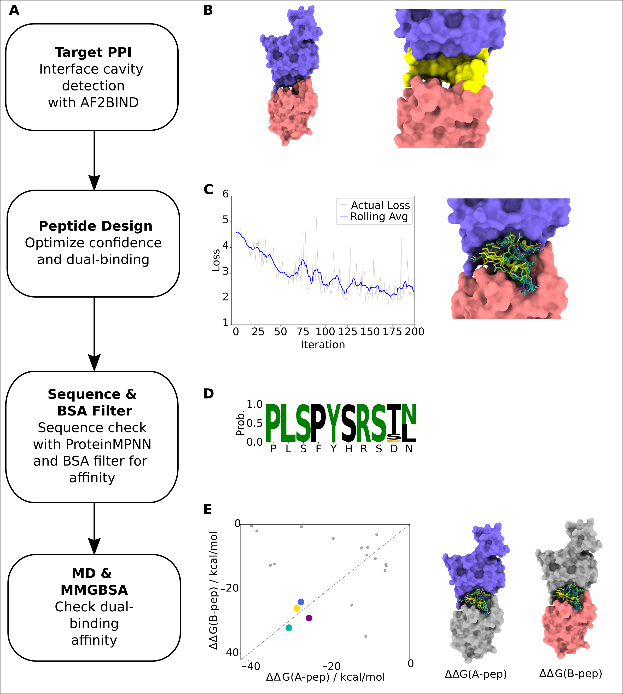

# Cyclic Peptide Binder Design for a Protein Dimer Interface



Computational pipeline for designing cyclic peptides that bind and stabilize a PPI interface, as described in our
[publication](https://onlinelibrary.wiley.com/doi/full/10.1002/prot.70123).
The pipeline runs in five sequential stages:

```
1. Structure prep  →  2. Pocket analysis  →  3. Design  →  4. Filtering  →  5. Simulation
  (pdb4amber)           (AF2BIND)           (ColabDesign)  (analysis/)      (AMBER MD)
```

## System Requirements

- **GPU:** NVIDIA RTX 4090 or better recommended for all GPU-accelerated stages: AF2BIND and ColabDesign (stages 2–3), ProteinMPNN filtering (stage 4), and MD simulation (stage 5). The 24 GB vRAM of the RTX 4090 can handle approximately **500 total residues** (target protein + peptide) for the design stages. If your target exceeds this, truncate it to the binding interface region before running.
- **CPU/RAM:** No special requirements beyond a standard workstation or HPC node.
- **Storage:** Design runs can be large; ensure sufficient scratch space for trajectory files in stage 5.

## Installation

### 1. General environment

[micromamba](https://mamba.readthedocs.io/en/latest/installation/micromamba-installation.html)
is recommended over conda for speed. `environment.yml` covers the analysis pipeline,
pdb4amber, and simulation analysis (pandas, mdtraj, biopython, ambertools, etc.):

```bash
micromamba env create -f environment.yml
micromamba activate peptide_design
```

Set the interpreter path in `config.yaml`:
```yaml
environments:
  python: "/path/to/micromamba/envs/peptide_design/bin/python"
```

### 2. ColabDesign environment

Required for stages 2 (AF2BIND), 3 (design), and 4 (ProteinMPNN filtering). Follow the
instructions at https://github.com/snazzels/ColabDesign to create a separate
environment with ColabDesign and JAX. Additionally install `mdtraj` with numpy
pinned to avoid breaking jaxlib:

```bash
pip install "numpy<2" "mdtraj"
```

Set the path in `config.yaml`:

```yaml
environments:
  python_gpu: "/path/to/colabdesign_env/bin/python"
```

### 3. AmberTools and AMBER

**AmberTools** (free) is already included in `environment.yml` and provides
`pdb4amber`, `tleap`, and `MMPBSA.py` for structure preparation, topology
building, and MM/GBSA analysis.

**AMBER** is required for GPU-accelerated production MD via `pmemd.cuda`.
AMBER is free for academic use but carries a licence fee for commercial use.
See https://ambermd.org/.

> **Alternative MD engines:** If you do not have an AMBER licence, GPU-accelerated
> MD can be run with [GROMACS](https://www.gromacs.org/) (free) or
> [OpenMM](https://openmm.org/) (free). The simulation setup scripts
> (`04_simulation/`) are written for AMBER and would need to be adapted.

### 4. AlphaFold2 weights

Download AlphaFold2 model parameters and set the path in `config.yaml`.

## Configuration

Edit **`config.yaml`** at the repository root before running any stage:

```yaml
paths:
  af2_params_dir: "/path/to/alphafold/weights"
  af2bind_params: "/path/to/af2bind_params/attempt_7_2k_lam0-03"
  target_pdb: "01_structure_prep/8zcs.pdb"
```

All scripts load this file automatically.

---

## Workflow

### Stage 1 — Structure Preparation

Clean the input PDB with pdb4amber:

```bash
pdb4amber -i target.pdb -o target_cleaned.pdb --prot
```

### Stage 2 — Pocket Analysis

Run AF2BIND to identify binding hotspot residues:

```bash
bash 02_pocket_analysis/run_af2bind.sh
```

### Stage 3 — Peptide Design

Submit the design job to SLURM. Runs unattended:

```bash
sbatch 03_design/submit.sh
```

### Stage 4 — Filtering & Analysis

Run the full analysis pipeline:

```bash
cd 03_design/analysis
bash run_pipeline.sh --runs_dir ../../design_runs
```

Inspect `summary_plots.png` (pLDDT, min BSA, sequence identity distributions),
then set the selection thresholds in `config.yaml`:

```yaml
analysis:
  seq_id_threshold: 0.3    # Avg Exact Identity
  bsa_min_threshold: 200.0  # min(BSA_A, BSA_B) in Ų
```

Copy the passing designs to `sim_pdbs/`:

```bash
python3 06_select_for_sim.py
```

### Stage 5 — Simulation

Set up and submit AMBER MD runs from the batch directory:

```bash
cd 04_simulation/run_sim

bash setup.sh                           # create dirs + build topologies
bash ../setup_scripts/submit_all.sh     # submit all jobs to SLURM
```

All residue ranges and paths are read automatically from each PDB.
Each job runs MD followed by MM/GBSA without further intervention.

---

---

## References

Tools used in this pipeline:

1. **AlphaFold2 Multimer** — R. Evans, M. O'Neill, A. Pritzel, et al., "Protein Complex Prediction with AlphaFold-Multimer," *bioRxiv* (2021). https://doi.org/10.1101/2021.10.04.463034

2. **ColabDesign** — sokrypton/ColabDesign: Making Protein Design Accessible to All via Google Colab. https://github.com/sokrypton/colabdesign

3. **Cyclic peptide offset** — S. A. Rettie, K. V. Campbell, A. K. Bera, et al., "Cyclic Peptide Structure Prediction and Design Using AlphaFold2," *Nature Communications* 16, 4730 (2025). https://doi.org/10.1038/s41467-025-59940-7

4. **AF2BIND** — A. Gazizov, A. Lian, C. A. Goverde, J. Mou, S. Ovchinnikov, and N. F. Polizzi, "AF2BIND: Predicting Small-Molecule Binding Sites Using the Pair Representation of AlphaFold2," *Nature Methods* 23, 626–635 (2026). https://doi.org/10.1038/s41592-026-03011-2

5. **ProteinMPNN** — J. Dauparas, I. Anishchenko, N. Bennett, et al., "Robust Deep Learning–Based Protein Sequence Design Using ProteinMPNN," *Science* 378 (2022): 49–56. https://doi.org/10.1126/science.add2187

6. **MDTraj** — R. T. McGibbon, K. A. Beauchamp, M. P. Harrigan, et al., "MDTraj: A Modern Open Library for the Analysis of Molecular Dynamics Trajectories," *Biophysical Journal* 109, no. 8 (2015): 1528–1532. https://doi.org/10.1016/j.bpj.2015.08.015

7. **AmberTools / AMBER** — D. A. Case, K. Belfon, I. Y. Ben-Shalom, et al., "AMBER 2020," University of California, San Francisco (2020). https://ambermd.org/

---

## License

MIT
